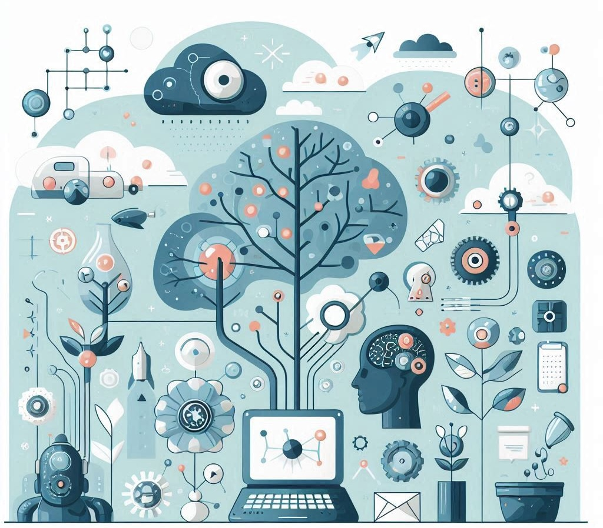

# Learning in Biological Systems: Decisions and Free Will

When we think about **learning**, we often think about school, books, and teachers. But learning happens in many ways, especially in **biological systems**, like our brains and the brains of animals. Let's explore how this works and how it relates to **making decisions and free will**, and how it connects to **artificial intelligence (AI)**, programming, and robotics.

## What is Learning in Biological Systems?

Learning in biological systems means how living things (like humans and animals) change their behavior based on experiences. For example, when a dog learns to sit because it gets a treat, that's learning. Our brains learn by forming connections between **neurons**, which are tiny cells that send messages. These connections help us **remember things** and improve our skills.

## How Do We Learn?

There are different ways we learn:

1. **Classical Conditioning:** This is when we learn to link two things together. For example, if you hear a bell every time you get a snack, soon you'll start to feel hungry just by hearing the bell. This is how Pavlov's dogs learned to salivate at the sound of a bell.

2. **Operant Conditioning:** This is when we learn from the consequences of our actions. If you do something good and get a reward, you'll want to do it again. If you do something bad and get punished, you'll avoid doing it again. This is how many animals and humans learn to behave.

3. **Observational Learning:** This is when we learn by watching others. If you see your friend solving a puzzle, you might learn how to solve it too just by observing. This type of learning is very important for social animals like humans.

## Decisions and Free Will

When we learn, we also make decisions. A decision is choosing between different options. For example, deciding what to eat for lunch or what game to play. Our decisions are influenced by our past experiences and what we've learned.

**Free Will** is the idea that we can choose our actions independently. But, are our decisions truly free? Let's explore this idea:

1. **Influences on Decisions:** Our decisions are often influenced by things we can't control. For example, our environment, our upbringing, and our experiences all shape our choices. If you've always had pizza on Fridays, you might choose pizza without really thinking about it.

2. **Brain and Choices:** Our brain makes decisions by weighing different options and predicting outcomes. Sometimes, our brain makes choices automatically based on what we've learned. Other times, we think carefully before deciding. This process involves different parts of the brain working together.

3. **True Freedom?:** Some scientists believe that our decisions are not completely free because they are based on previous experiences and biological processes. Others believe that we still have the power to make choices, even if they are influenced by other factors.

## Learning and Robots

In artificial intelligence (AI) and robotics, we try to **mimic** how biological systems learn. Let's see how this works:

1. **Machine Learning:** Just like our brains, AI systems can learn from experiences. Machine learning is a type of AI where computers learn from data. For example, a computer can learn to recognize pictures of cats by looking at many cat photos and finding patterns.

2. **Reinforcement Learning:** This is similar to operant conditioning in animals. In reinforcement learning, an AI learns by trying different actions and receiving rewards or punishments. For example, a robot can learn to navigate a maze by getting points for moving in the right direction and losing points for hitting walls.

3. **Neural Networks:** These are computer systems modeled after the human brain. They consist of layers of interconnected nodes (like neurons) that process information. Neural networks are used in many AI applications, such as recognizing speech or translating languages.

## Programming AI and Robots

Programming AI and robots involves writing code that allows them to learn and make decisions. Here are some key points:

1. **Algorithms:** Algorithms are step-by-step instructions for solving problems. In AI, algorithms help computers learn from data. For example, a sorting algorithm can help a robot organize objects by size.

2. **Sensors and Actuators:** Robots use sensors to collect information about their environment (like cameras or touch sensors) and actuators to perform actions (like moving arms or wheels). Programming involves making sure the robot can process sensor data and respond appropriately.

3. **Autonomous Decision-Making:** Advanced AI systems can make decisions on their own, based on their programming and learning. For example, self-driving cars use AI to decide when to turn, stop, or speed up, based on data from their sensors.

## Conclusion

Learning in biological systems is a complex process that helps living things adapt and survive. By understanding how we learn and make decisions, we can create better AI and robots. These smart machines can learn from experiences, make decisions, and help us in many ways. So, every choice we make, whether influenced by our past or not, helps us grow and learn even more, just like the AI and robots we build.