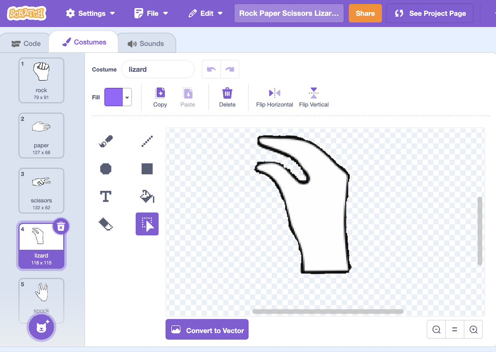
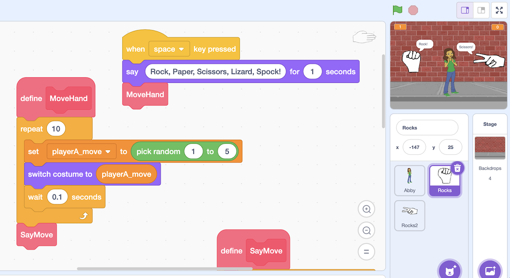

# Programming Graphics and Animation

# The Checklist

1. Create the game project in Scratch on its **web version**: [scratch.mit.edu](https://scratch.mit.edu).
2. First, choose a background for the game and insert text in the bottom right corner with the names of the 3. programming team members (pair).
4. Search the internet for 5 images of hands representing the different options for playing Rock, Paper, Scissors, Lizard, Spock. The images should have appropriate quality and resolution.
4. Each of the 5 images should be in a separate PNG file with the following names: rock.png, paper.png, scissors.png, lizard.png, and spock.png.
5. Modify the images if necessary to have a transparent background. You can remove the background using Scratch tools or other tools like GIMP or websites such as [www.remove.bg/es](https://www.remove.bg/es).
6. Create 3 sprites in Scratch: one for the game referee (a person) and two for each hand (player A and B).
7. Use the 5 prepared images to define 5 costumes for each hand in Scratch.
8. Program the necessary code in the referee and each hand so that, when the space key is pressed, the animation starts simultaneously in each hand and ends with a random option.
9. Test that everything works correctly.
10. Download the Scratch project file (.sb3) and rename it according to the last names and names of the members 9. 1 and 2 of the team: LastName1FirstName1_LastName2FirstName2.sb3 (for example: PérezJuan_LópezAna.sb3)
11. Attach submit the .sb3 file here.

# 7. Five costumes: rock, paper, scissors, lizard, and Spock

Use the 5 prepared images to define 5 costumes for each hand in Scratch.

# 8. The animation code

Program the necessary code in the referee and each hand so that, when the space key is pressed, the animation starts simultaneously in each hand and ends with a random option.

