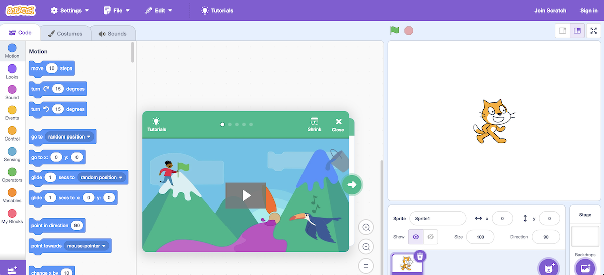
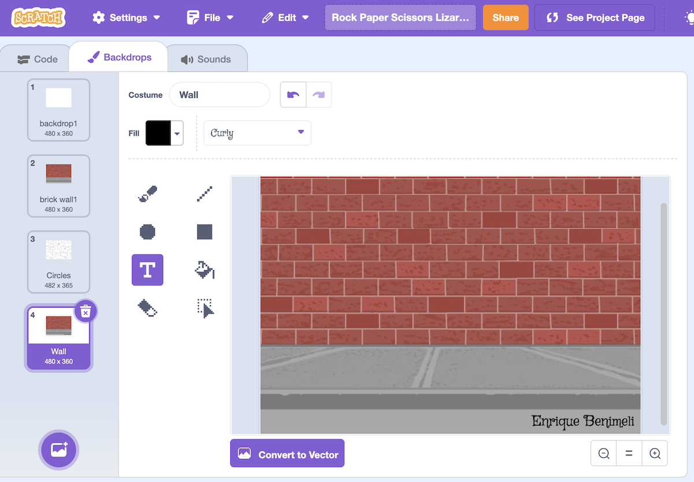
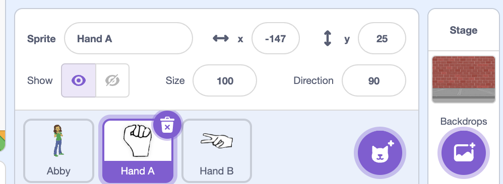
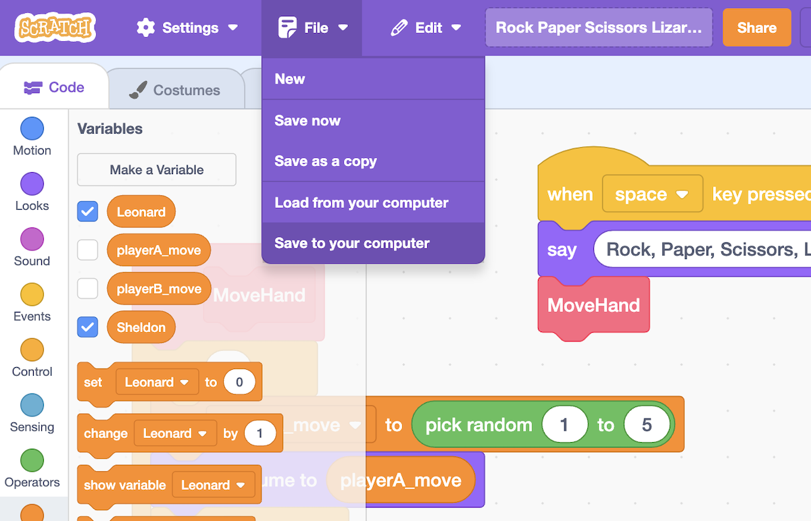

# Programming Graphics and Animation

In this stage of the project, we will program the animation of both hands. When we press the space key, the two hands will start displaying various random positions (rock, paper, scissors, lizard, Spock). Finally, one fixed hand position will remain. In other words, in this version of the game, the machine plays against itself, showing two random moves, one for player A and another for player B.

# The Checklist

1. Create the game project in Scratch on its **web version**: [scratch.mit.edu](https://scratch.mit.edu).
2. First, choose a background for the game and insert text in the bottom right corner with the names of the programming team members (pair).
3. Search the internet for 5 images of hands representing the different options for playing Rock, Paper, Scissors, Lizard, Spock. The images should have appropriate quality and resolution.
4. Each of the 5 images should be in a separate PNG file with the following names: rock.png, paper.png, scissors.png, lizard.png, and spock.png. Modify the images if necessary to have a transparent background. You can remove the background using Scratch tools or other tools like GIMP or websites such as [www.remove.bg/es](https://www.remove.bg/es).
5. Create 3 sprites in Scratch: one for the game referee (a person) and two for each hand (player A and B).
6. Use the 5 prepared images to define 5 costumes for each hand in Scratch.
7. Program the necessary code in the referee and each hand so that, when the space key is pressed, the animation starts simultaneously in each hand and ends with a random option.
8. Test that everything works correctly.
9. Download the Scratch project file (.sb3) and rename it according to the last names and names of the members 9. 1 and 2 of the team: LastName1FirstName1_LastName2FirstName2.sb3 (for example: PérezJuan_LópezAna.sb3)
10. Attach submit the .sb3 file here.

## 1. Scratch

Scratch is a visual programming language and an online community developed by the MIT Media Lab. It is designed to be user-friendly, especially for beginners, allowing them to create interactive stories, games, and animations without the need for traditional coding. Scratch uses a drag-and-drop interface where users snap together blocks of code, making it accessible to people of all ages.

You can use Scratch online. The platform is web-based, and you can access it through your web browser. This means you don't need to download or install any software to start programming in Scratch. The online version allows users to create, share, and remix projects, fostering a collaborative and creative learning environment. You can find the Scratch platform at the official website: [scratch.mit.edu/](https://scratch.mit.edu/).

# 2. The Background

First, choose a background for the game and insert text in the bottom right corner with the names of the

# 3. Five images

Search the internet for 5 images of hands representing the different options for playing Rock, Paper, Scissors, Lizard, Spock. The images should have appropriate quality and resolution.

Each of the 5 images should be in a separate PNG file with the following names:

    rock.png
    paper.png
    scissors.png
    lizard.png
    spock.png

## 4. Edit the pictures

Modify the images if necessary to have a transparent background. You can remove the background using Scratch tools or other tools like GIMP or websites such as [www.remove.bg/es](https://www.remove.bg/es).

<iframe width="560" height="315" src="https://www.youtube.com/embed/2bayy0ZoPqM?si=oQ4uhBakdWHni6T7" title="YouTube video player" frameborder="0" allow="accelerometer; autoplay; clipboard-write; encrypted-media; gyroscope; picture-in-picture; web-share" allowfullscreen></iframe>
 

## 5. The Sprites

Create 3 sprites in Scratch: one for the game referee (a person) and two for each hand (player A and B).

In Scratch, a sprite is a graphic object or character that can be programmed to perform various actions. Sprites are the interactive elements in a Scratch project, and they can be customized and controlled using Scratch's visual programming language.

Each sprite has its own set of scripts (programming instructions) that dictate its behavior. Users can create or choose sprites from Scratch's library, which includes a variety of characters, animals, objects, and more. Sprites can be moved, rotated, and resized, and they can respond to different events or user inputs, such as keyboard presses or mouse clicks.

In the context of a game like Rock Paper Scissors Lizard Spock, sprites represent the hands making different gestures, and their movements and positions.

## 6. Five costumes: rock, paper, scissors, lizard, and Spock

Use the 5 prepared images to define 5 costumes for each hand in Scratch.

## 7. The animation code

Program the necessary code in the referee and each hand so that, when the space key is pressed, the animation starts simultaneously in each hand and ends with a random option.

## 8. Test it!

Test that everything works correctly.

## 9. Download the Scratch project file (.sb3)

Download the Scratch project file (.sb3) and rename it according to the last names and names of the members 1 and 2 of the team:

    LastName1FirstName1_LastName2FirstName2.sb3
    
For example:
    
    PérezJuan_LópezAna.sb3

## 10. Turn in your project

Attach and submit the .sb3 file. [This is how](https://support.microsoft.com/en-au/topic/turn-in-an-assignment-in-microsoft-teams-e25f383a-b747-4a0b-b6d5-a2845a52092b).

