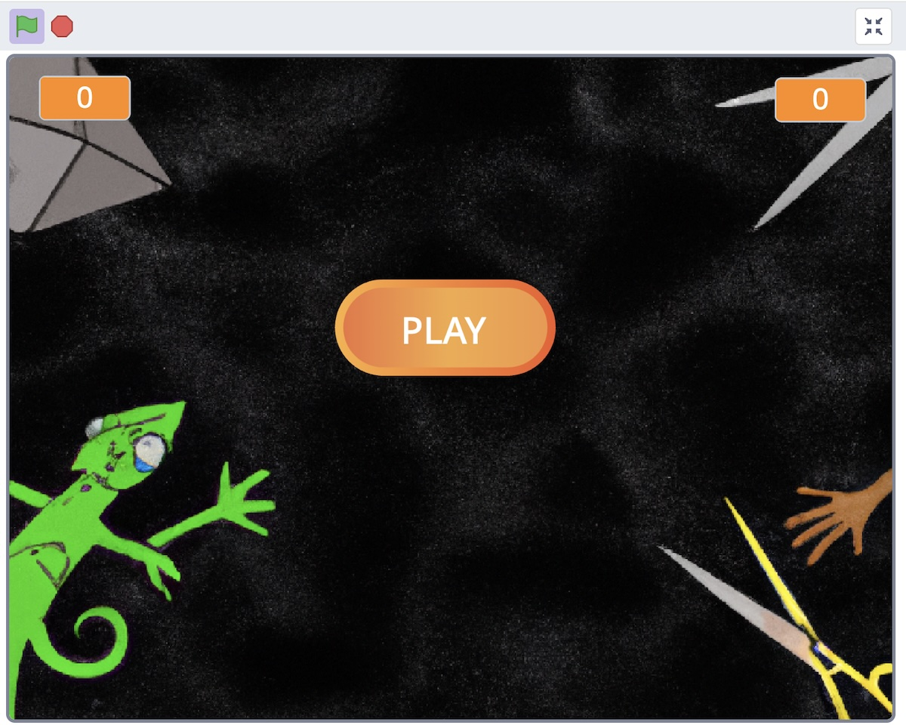

# Final Version and Testing

Create a final version of the videogame: add a point system, sound effects and music, and test the app.

Add the last functions:

- Adding points
- Main menu and start button
- Player wins with 3 points + Message announcing the winner
- Game Over backdrop when the game ends
- Add sound effects and background music to your project.
- Test your video game

## Create the main menu backdrop with AI

Use an AI tool like DALL-E or Copilot to create an illustration for the main manu backdrop.

- [DALL-E](https://openai.com/dall-e-2)
- [Copilot](https://copilot.microsoft.com/?form=MY02E6&OCID=MY02E6&culture=es-es&country=es)

### Important

Save the text of the prompt that you used to generate the illustration. You will have to submit it in the activity.

## Music and Sound Effects

You can find music and sound effects here:
 
### Music

- https://www.jamendo.com/

### Sound Effects

- https://pixabay.com/es/sound-effects/	
- https://soundbible.com/
- https://mixkit.co/free-sound-effects/	
- https://freesound.org/browse/tags/sound-effects/
