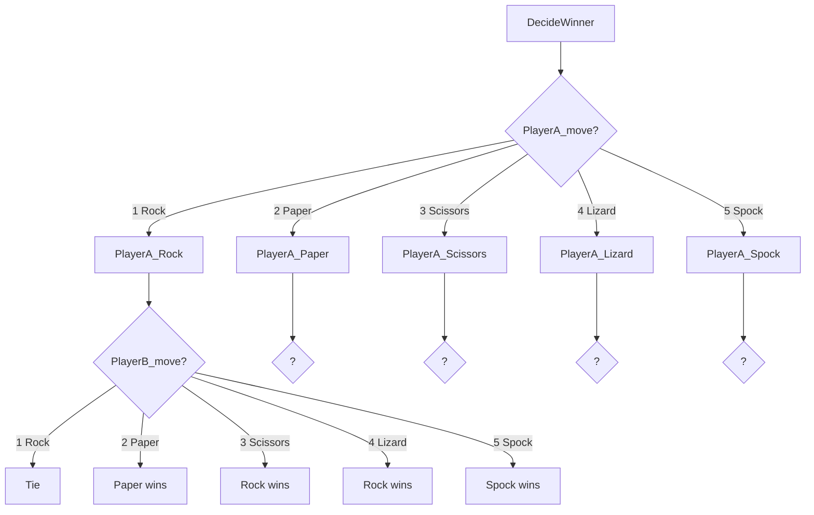

# Logic and Flow Control

In this phase of game development, we will program the referee Sprite, which will be responsible for **deciding** the winner after each move.

To achieve this, we need to create several code blocks: *DecideWinner*, *PlayerA_Rock*, *PlayerA_Paper*, *PlayerA_Scissors*, *PlayerA_Lizard*, and *PlayerA_Spock*.

## *DecideWinner* block

The ***DecideWinner*** block will first check the value of **Player A's move**, and based on this value (1, 2, 3, 4, or 5), the corresponding block (PlayerA_Rock, PlayerA_Paper, etc.) will be called to check the value of **Player B's move**. In this latter block, the message for the **winning move** will be displayed, and **points** will be added to each player.

<pre><code class="mermaid">

</code></pre>

## *PlayerA_* blocks

