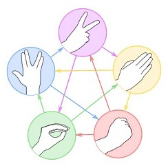
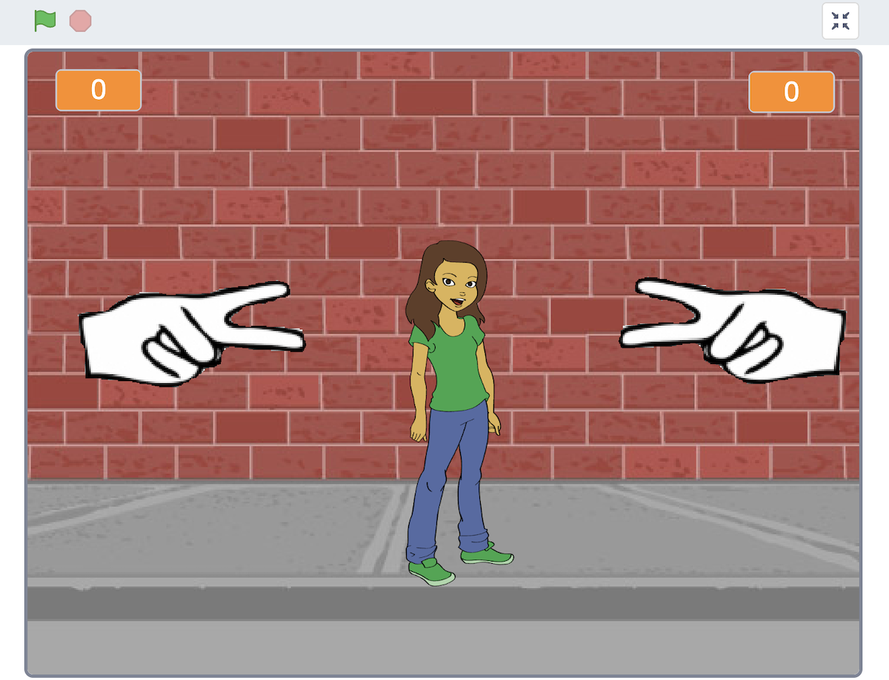

# Understanding the Game Rules: Rock, Paper, Scissors, Lizard, Spock

The game is an **expansion** on the game ***Rock, Paper, Scissors***. Each player picks a variable and reveals it at the same time. The winner is the one who defeats the others. In a tie, the process is repeated until a winner is found.

<iframe width="560" height="315" src="https://www.youtube.com/embed/x5Q6-wMx-K8?si=JpsXK2z8lLhy70rK" title="YouTube video player" frameborder="0" allow="accelerometer; autoplay; clipboard-write; encrypted-media; gyroscope; picture-in-picture; web-share" allowfullscreen></iframe>
 

# The Rules

1.	Scissors cuts paper.
2.	Paper covers rock.
3.	Rock crushes lizard.
4.	Lizard poisons Spock.
5.	Spock smashes scissors.
6.	Scissors decapitates lizard.
7.	Lizard eats paper.
8.	Paper disproves Spock.
9.	Spock vaporizes rock.
10.	Rock crushes scissors.

# The Game

