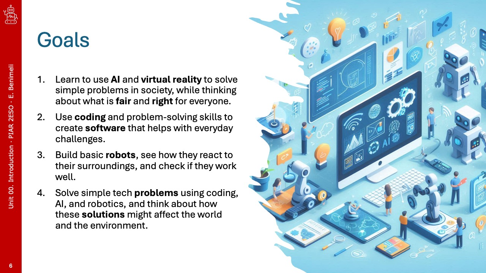
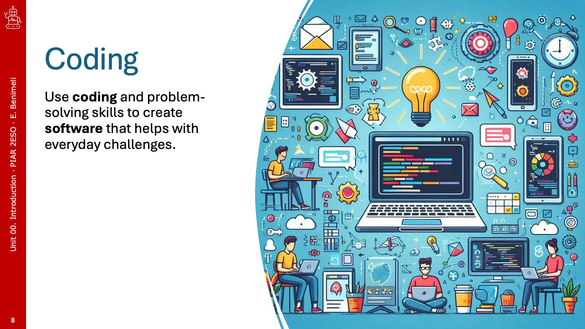
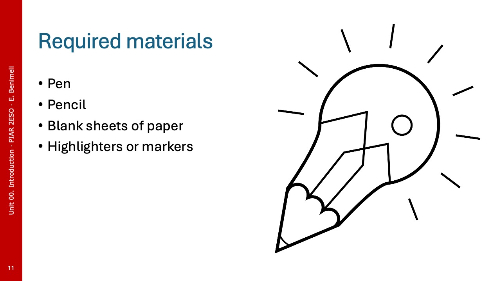

# Artificial Intelligence, Programming and Robotics

**Artificial intelligence** (AI) and **robotics** are really interesting things that are now part of our daily lives. They are used in many tasks we do every day and are also connected to **programming**, which is like giving instructions to computers to do incredible things. These are very important things that are changing how we live.

In the second half of the last century, there was a digital revolution that made the era of information possible. However, it wasn't until a few years later, when the **Internet** became more accessible and computers could automatically process large amounts of information, that we truly entered the information society, which is like the successor to the industrial era.

Now, since the beginning of this century, **computing** (which means using computers) and its application in non-biological intelligent systems and **robots** are causing another significant change in how we live. This is like a new industrial revolution, marking a very important moment in the development of our society.

In school, when we learn about **artificial intelligence, programming, and robotics**, we are using **computational thinking**, which is like learning to think like a computer. We learn to develop computer programs, use artificial intelligence techniques, and even program robots. We also discuss **how these technologies impact society**, and we talk about the scientific, ethical, and social aspects of all this. In summary, we are learning very interesting things that help us understand and be part of the modern world.

## Slides

  
  
  
  
  
  
  
  
  

